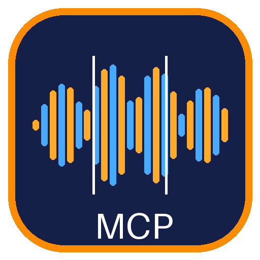

<p align="center"></p>

<h1 align="center">Audacity MCP Server</h1>

<p align="center">
  <a href="README.md">English</a> · <a href="README.es.md">Español</a> · <a href="README.pt-BR.md">Português</a> · <a href="README.fr.md">Français</a> · <b>Deutsch</b> · <a href="README.ru.md">Русский</a> · <a href="README.zh-CN.md">简体中文</a> · <a href="README.ja.md">日本語</a> · <a href="README.ko.md">한국어</a>
</p>

<p align="center">
  Lassen Sie Claude Audio mit dem auf Ihrem Windows-PC installierten <b>Audacity 4</b> bearbeiten:<br>
  teilen, schneiden, konvertieren, resampeln, Effekte anwenden, mischen und zusammenfügen, dazu eine <b>Erweiterung direkt in Audacity</b>.
</p>

---

## Warum

Audacity 4 ist ein hervorragender Open-Source-Audioeditor, hat aber **keine Skriptschnittstelle** (kein `mod-script-pipe`, kein Kommandozeilen-Export). Dieser [Model Context Protocol](https://modelcontextprotocol.io)-Server gibt Claude Zugriff auf Audacitys eigene Audio-Engine, sodass Sie zum Beispiel fragen können:

> *„Teile jede Aufnahme in `D:\stimme` in 15-Sekunden-Stücke, ein Ordner pro Datei.“*
> *„Konvertiere `D:\podcast\ep1.wav` in FLAC 24 Bit mit 48 kHz.“*
> *„Wende auf `D:\take3.wav` einen Hochpass bei 80 Hz und einen Kompressor an und normalisiere auf -1 dBFS.“*

Inspiriert von [VectorMagic-mcp-server](https://github.com/jhonsu01/VectorMagic-mcp-server).

## Funktionsweise

| Teil | Beschreibung |
| --- | --- |
| **Native Engine** (`aumcp-engine.exe`, C++) | Lädt zur Laufzeit Audacity 4s eigene Codec-Bibliotheken (**libsndfile 1.2.2**, **mpg123**) aus dem Installationsordner und liest und schreibt damit genau das, was Ihr Audacity unterstützt. Verarbeitet lange Dateien im Stream; hochwertiges Windowed-Sinc-Resampling. |
| **MCP-Server** (Node.js) | 10 Werkzeuge für Claude. Optional FFmpeg für MP3/M4A/AAC/WMA-Export und seltene Importformate. |
| **Audacity-Erweiterung** („MCP Audio Tools“) | Offizielle Audacity-4-Erweiterung (JavaScript + native DLL), die Effekte in Audacitys eigene Menüs einfügt. Installation mit einem einzigen Aufruf. |

## Werkzeuge

| Werkzeug | Funktion |
| --- | --- |
| `split_audio` | Teilt eine oder viele Dateien in N-Sekunden-Stücke (Standard 15 s), ein Ordner pro Eingabe, nummeriert `<name>_001.wav`… |
| `convert_audio` | Ändert Format, Bittiefe, Abtastrate oder Kanäle |
| `trim_audio` | Behält einen Zeitbereich, optional mit Ein-/Ausblenden |
| `apply_effects` | Effektkette (siehe unten) |
| `mix_audio` | Mischt Dateien übereinander mit Pegel und Startversatz pro Datei |
| `concat_audio` | Fügt Dateien mit Equal-Power-Überblendung oder Pause zusammen |
| `get_audio_info` | Format, Abtastrate, Kanäle, Dauer, Spitzen- und RMS-Pegel |
| `open_in_audacity` | Öffnet Ergebnisse im Audacity-4-Editor |
| `install_audacity_extension` | Installiert / aktualisiert / entfernt die Erweiterung |
| `get_audacity_status` | Audacity-Pfad und -Version, Engine, FFmpeg, Formate, Effekte |

## Formate

| | |
| --- | --- |
| **Eingabe (nativ)** | wav, aiff, flac, ogg, opus, mp3, mp2, caf, w64, rf64, au, voc, sd2, iff, paf… |
| **Eingabe (über FFmpeg)** | m4a, aac, mp4, wma, wv, ac3, webm, mkv, ape… |
| **Ausgabe (nativ)** | wav, flac, ogg (Vorbis), opus, aiff, caf, w64, rf64, au |
| **Ausgabe (über FFmpeg)** | mp3, m4a, aac, wma |
| **Optionen** | Bittiefe `pcm8/16/24/32`, `float32/64` · beliebige Abtastrate · Mono/Stereo · Vorbis/Opus-Qualität · FLAC-Kompression · Bitrate |

## Effekte

`gain` · `normalize` · `fade_in` · `fade_out` (linear, exponentiell, logarithmisch, S-Kurve) · `trim` · `pad` · `trim_silence` · `reverse` · `speed` · `invert` · `remove_dc` · `highpass` · `lowpass` · `bandpass` · `notch` · `eq` · `bass` · `treble` · `echo` · `compressor` · `limiter` · `noise_gate` · `mono` · `stereo` · `swap_channels` · `pan` · **`mouth_declick`** · **`declip`** · **`noise_reduction`** · **`click_removal`**

Beispiel: `[{"type":"highpass","frequency":80},{"type":"compressor","threshold_db":-20,"ratio":3},{"type":"normalize","peak_db":-1}]`

Voice cleanup / limpieza de voz: `[{"type":"declip"},{"type":"mouth_declick","sensitivity":6},{"type":"limiter","ceiling_db":-1}]`

## In Audacity (Erweiterung)

Nach `install_audacity_extension` und einem Neustart von Audacity 4:

| Menü | Effekt |
| --- | --- |
| Werkzeuge › Erweiterung › audacity-mcp-server | **Split into Files (MCP)**: schreibt die Auswahl (oder jede ausgewählte Spur) als N-Sekunden-Dateien |
| | **Export Selection to File (MCP)**: WAV, FLAC, OGG, Opus, AIFF |
| | **Import Audio File as Track (MCP)**: jede unterstützte Datei (auch MP3) als neue Spur |
| Analyse › Erweiterung › audacity-mcp-server | **Labels Every N Seconds (MCP)**: eine Textmarkenspur mit einem Bereich pro Intervall |
| Werkzeuge | **MCP Audio Tools: status**: prüft die native Bibliothek |

Alle unterstützen Rückgängig und zeigen einen Fortschrittsbalken.

## Voraussetzungen

- Windows 10/11 x64
- **Audacity 4** (getestet mit **4.0.1**)
- Node.js ≥ 20 (bei `.mcpb`-Installation in Claude Desktop enthalten)
- Optional: FFmpeg (nur für MP3/M4A/AAC/WMA-Export oder M4A/AAC/WMA/WavPack-Import)

## Installation

### Claude Desktop (empfohlen)

1. Laden Sie `audacity-mcp-server.mcpb` vom [neuesten Release](https://github.com/jhonsu01/audacity-mcp-server/releases/latest) herunter.
2. Doppelklicken (oder in Claude Desktop → *Einstellungen → Erweiterungen* ziehen) und auf **Installieren** klicken.
3. Optional: Liegt Audacity nicht in `C:\Program Files\Audacity 4`, den Ordner in den Erweiterungseinstellungen angeben; den FFmpeg-Pfad angeben, falls nicht im `PATH`.
4. Optional: Bitten Sie Claude *„installiere die Audacity-Erweiterung“* und starten Sie Audacity neu.

### Claude Code / andere MCP-Clients

```bash
git clone https://github.com/jhonsu01/audacity-mcp-server.git
cd audacity-mcp-server
npm install
npm run build:all
claude mcp add audacity -- node "%CD%\dist\bundle.cjs"
```

`build:all` kompiliert die nativen Teile und benötigt Visual Studio mit der C++-Workload.

## Konfiguration

| Variable | Bedeutung |
| --- | --- |
| `AUDACITY_DIR` | Installationsordner von Audacity 4 (oder `Audacity4.exe`). Standard: `C:\Program Files\Audacity 4` |
| `FFMPEG_PATH` | `ffmpeg.exe` oder dessen Ordner. Standard: aus dem `PATH` |
| `AUDACITY_MCP_TIMEOUT` | Maximale Sekunden pro Auftrag (Standard 1800) |

## Sicherheit

- Dateien werden **nie überschrieben**, außer mit `overwrite: true`.
- Alle Pfade müssen absolut sein; die Eingabe wird nie verändert.
- Alles läuft lokal, ohne Netzwerkzugriff.

## Entwicklung

```bash
npm run build:native   # aumcp-engine.exe + audacity_mcp_native.dll (MSVC)
npm run build          # TypeScript + Bundle
npm run test:e2e       # 25 End-to-End-Prüfungen über echtes MCP-stdio (synthetisches Audio)
npm run pack:mcpb      # audacity-mcp-server.mcpb
```

## Lizenz

GPL-3.0-only. Der ABI-Header der Erweiterung stammt aus Audacity (GPL-3.0).
Audacity® ist eine Marke der Muse Group. Dieses Projekt ist weder mit Audacity noch mit der Muse Group verbunden oder von ihnen unterstützt.
